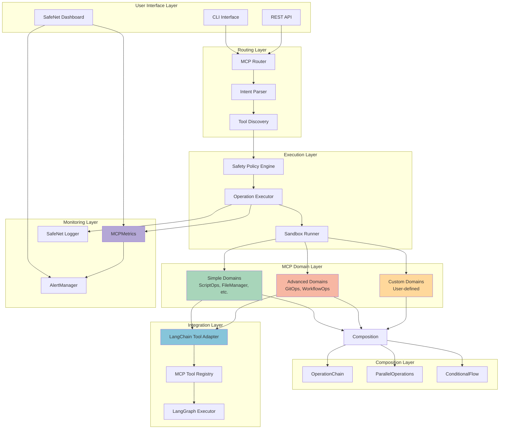
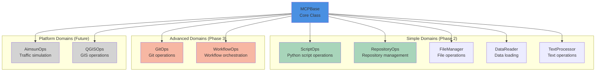
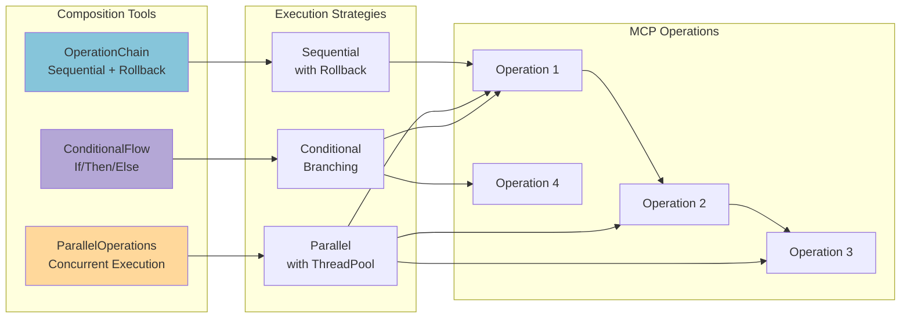
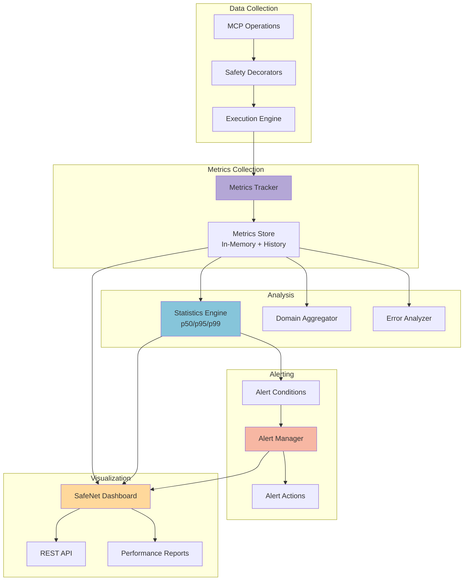
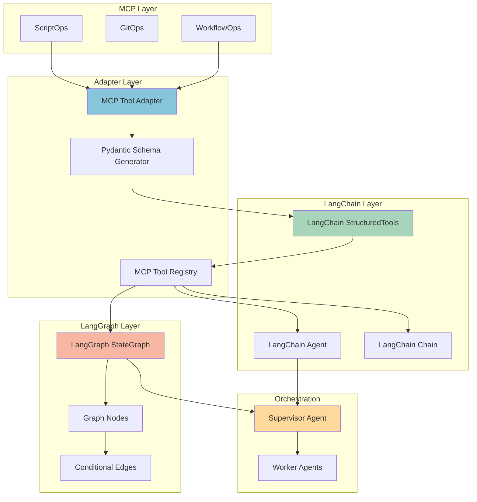
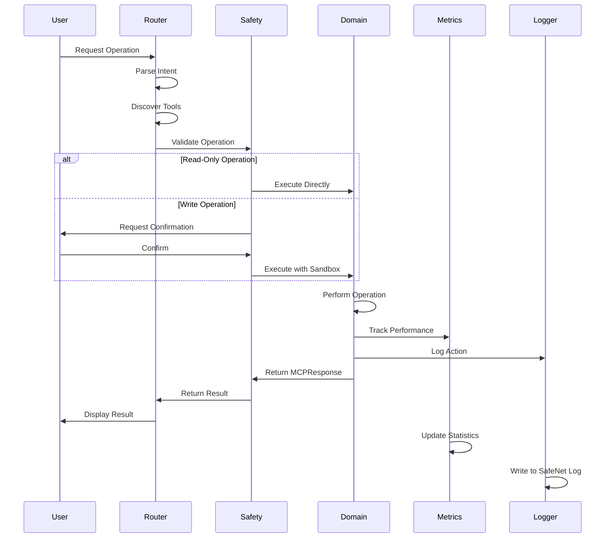
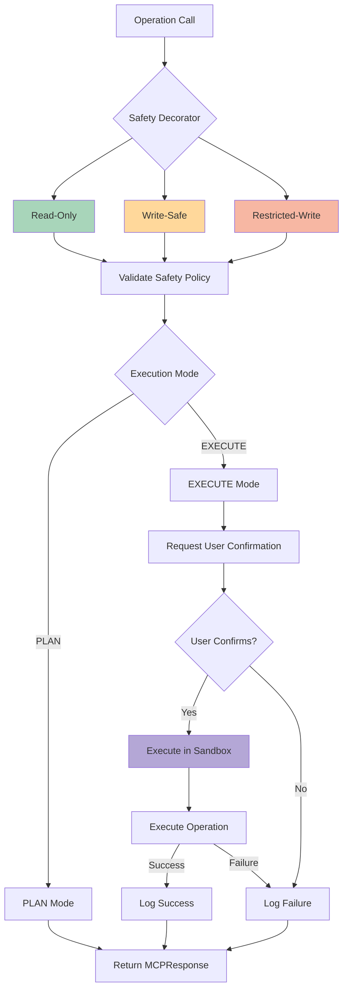
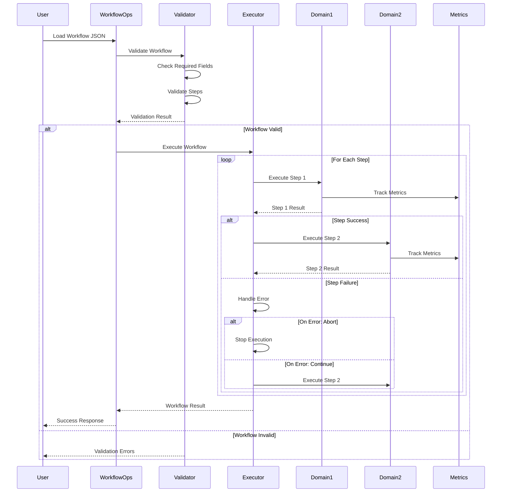
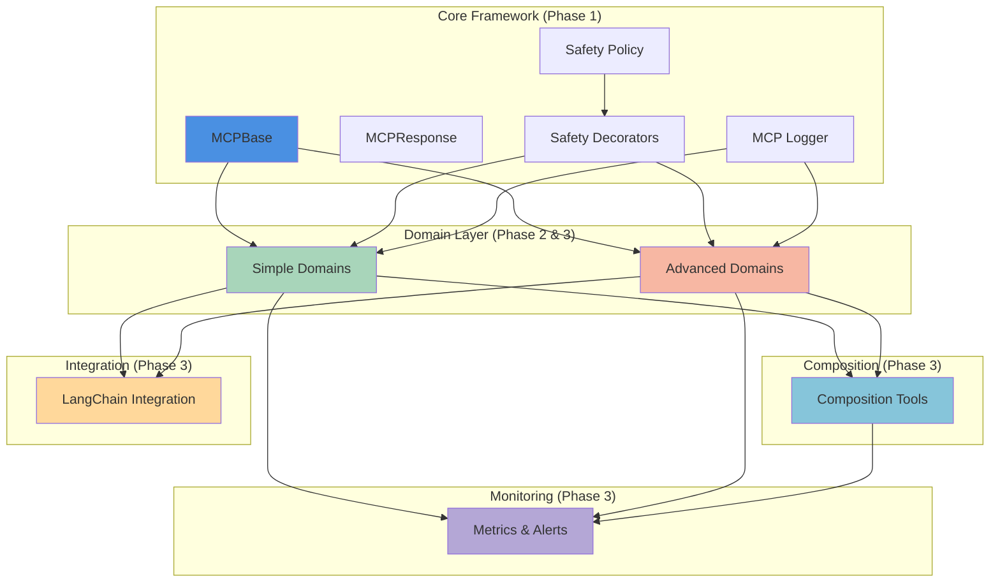

# Pulsus MCP Architecture Documentation

**Version**: 4.0 (Phase 3 Complete)
**Date**: November 17, 2025
**Status**: Production Ready

---

## Table of Contents

1. [System Overview](#system-overview)
2. [Architecture Diagrams](#architecture-diagrams)
3. [Component Details](#component-details)
4. [Data Flow](#data-flow)
5. [Deployment Architecture](#deployment-architecture)
6. [Integration Patterns](#integration-patterns)
7. [Security Architecture](#security-architecture)

---

## System Overview

Pulsus is a comprehensive Model Context Protocol (MCP) orchestration platform built on a multi-tier architecture that combines:

- **Core MCP Framework** (Phase 1)
- **Simple MCP Domains** (Phase 2)
- **Advanced MCP Domains** (Phase 3)
- **Workflow Composition** (Phase 3)
- **Monitoring & Observability** (Phase 3)
- **LangChain/LangGraph Integration** (Phase 3)

### Key Characteristics

- **Modular**: Clear separation of concerns across domains
- **Safe**: Multi-level safety decorators and execution modes
- **Observable**: Comprehensive logging and metrics
- **Extensible**: Plugin architecture for custom domains
- **LangChain Native**: Built on LangChain Tools and LangGraph StateGraph

---

## Architecture Diagrams

### 1. System Architecture Overview



### 2. MCP Domain Hierarchy



### 3. Workflow Composition Architecture



### 4. Monitoring & Observability Architecture



### 5. LangChain Integration Architecture



### 6. Data Flow Diagram



### 7. Safety Decorator Flow



### 8. Workflow Execution Sequence



### 9. Component Interaction Map



---

## Component Details

### Core Components

#### MCPBase
- **Location**: `mcp/core/base.py`
- **Purpose**: Base class for all MCP domains
- **Key Features**:
  - Standardized MCPResponse format
  - Capability introspection
  - Operation logging
  - Context management

#### Safety Decorators
- **Location**: `mcp/core/decorators.py`
- **Types**:
  - `@read_only` - Safe read operations
  - `@write_safe` - Write operations with confirmation
  - `@restricted_write` - Platform-restricted writes
  - `@transactional` - Operations with rollback
  - `@cached` - Cached operations

#### Safety Policy
- **Location**: `mcp/core/policy.py`
- **Modes**:
  - `PLAN` - Planning mode (no execution)
  - `EXECUTE` - Full execution
  - `UNSAFE` - Unrestricted (developer mode)

### Simple Domains (Phase 2)

| Domain | Purpose | Operations | Safety Level |
|--------|---------|------------|--------------|
| ScriptOps | Python script operations | 5 | Read-only, Write-safe |
| RepositoryOps | Repository management | 4+ | Read-only, Write-safe |
| FileManager | File operations | 6 | Read-only, Write-safe |
| DataReader | Data loading | 4 | Read-only, Cached |
| TextProcessor | Text operations | 4+ | Read-only, Write-safe |

### Advanced Domains (Phase 3)

| Domain | Purpose | Operations | Safety Level |
|--------|---------|------------|--------------|
| GitOps | Git operations | 8 | Read-only, Write-safe |
| WorkflowOps | Workflow orchestration | 5 | Read-only, Write-safe |

### Composition Tools (Phase 3)

| Tool | Purpose | Key Features |
|------|---------|--------------|
| OperationChain | Sequential execution | Rollback support, error recovery |
| ParallelOperations | Concurrent execution | Thread pooling, result aggregation |
| ConditionalFlow | Conditional execution | If/then/else, switch-case |

### Monitoring Components (Phase 3)

| Component | Purpose | Key Features |
|-----------|---------|--------------|
| MCPMetrics | Performance tracking | p50/p95/p99, error rates |
| AlertManager | Alert system | Severity levels, cooldown |
| SafeNet Dashboard | Web UI | REST API, real-time monitoring |

---

## Data Flow

### Operation Execution Flow

1. **Request Initiation**
   - User sends request via CLI/API
   - Request contains operation name and parameters

2. **Intent Parsing**
   - Router parses user intent
   - Identifies domain and operation
   - Extracts parameters

3. **Tool Discovery**
   - Search available domains
   - Score candidates
   - Select best match

4. **Safety Validation**
   - Check safety decorator
   - Validate execution mode
   - Request confirmation (if needed)

5. **Operation Execution**
   - Execute in sandbox (if restricted)
   - Perform operation
   - Track metrics

6. **Response Generation**
   - Create MCPResponse
   - Add trace information
   - Log to SafeNet

7. **Result Delivery**
   - Return to router
   - Format for user
   - Display result

### Metrics Collection Flow

1. **Operation Start**
   - Record timestamp
   - Capture context

2. **Execution**
   - Monitor duration
   - Track status

3. **Operation Complete**
   - Calculate duration
   - Create OperationMetric
   - Add to metrics store

4. **Aggregation**
   - Update domain statistics
   - Calculate percentiles
   - Update error rates

5. **Alerting**
   - Check alert conditions
   - Trigger alerts if needed
   - Execute alert actions

6. **Visualization**
   - Update dashboard
   - Provide API data
   - Generate reports

---

## Deployment Architecture

### Development Environment

```
┌─────────────────────────────────────┐
│         Developer Machine           │
│  ┌──────────────────────────────┐   │
│  │       Pulsus CLI             │   │
│  │   (Direct Execution)         │   │
│  └──────────────────────────────┘   │
│  ┌──────────────────────────────┐   │
│  │    Local Git Repository      │   │
│  └──────────────────────────────┘   │
│  ┌──────────────────────────────┐   │
│  │   SafeNet Dashboard          │   │
│  │   (localhost:5000)           │   │
│  └──────────────────────────────┘   │
└─────────────────────────────────────┘
```

### Production Environment (Future)

```
┌─────────────────────────────────────────────────────────┐
│                    Load Balancer                        │
└────────────┬────────────────────────────┬───────────────┘
             │                            │
    ┌────────▼────────┐         ┌────────▼────────┐
    │   API Server 1  │         │   API Server 2  │
    │   (FastAPI)     │         │   (FastAPI)     │
    └────────┬────────┘         └────────┬────────┘
             │                            │
    ┌────────▼────────────────────────────▼────────┐
    │          Message Queue (Redis)               │
    └────────┬─────────────────────────────────────┘
             │
    ┌────────▼────────┐
    │  Worker Pool    │
    │  (Celery)       │
    └────────┬────────┘
             │
    ┌────────▼─────────────────────────────────────┐
    │     Monitoring & Metrics (Prometheus)        │
    └──────────────────────────────────────────────┘
```

### Container Architecture (Future)

```
┌────────────────────────────────────────────────────────┐
│                  Docker Compose                        │
│  ┌──────────────┐  ┌──────────────┐  ┌─────────────┐  │
│  │  API Service │  │ Worker Service│  │  Dashboard  │  │
│  │  (FastAPI)   │  │  (Celery)    │  │   (Flask)   │  │
│  └──────┬───────┘  └──────┬───────┘  └──────┬──────┘  │
│         │                  │                  │         │
│  ┌──────▼──────────────────▼──────────────────▼──────┐ │
│  │            Shared Volume (Logs & Metrics)         │ │
│  └───────────────────────────────────────────────────┘ │
│  ┌───────────────────────────────────────────────────┐ │
│  │              Redis (Message Queue)                │ │
│  └───────────────────────────────────────────────────┘ │
└────────────────────────────────────────────────────────┘
```

---

## Integration Patterns

### Pattern 1: Simple Domain Usage

```python
from mcp.simple import ScriptOps

script_ops = ScriptOps()
result = script_ops.read_script(path='main.py')

if result.success:
    print(f"Script structure: {result.data['structure']}")
```

### Pattern 2: Workflow Composition

```python
from mcp.composition import OperationChain
from mcp.simple import ScriptOps
from mcp.advanced import GitOps

chain = OperationChain("git_workflow")
chain.add(git_ops, 'get_status', repo_path='.')
chain.add(script_ops, 'format_script', path='main.py')
chain.add(git_ops, 'commit', repo_path='.', message='Format code')

result = chain.execute()
```

### Pattern 3: LangChain Integration

```python
from langchain.tool_adapter import mcp_to_langchain_tool
from mcp.simple import ScriptOps
from langchain.agents import AgentExecutor

tool = mcp_to_langchain_tool(ScriptOps)
agent = AgentExecutor(tools=[tool], ...)
```

### Pattern 4: Monitoring Setup

```python
from mcp.monitoring.metrics import get_metrics
from mcp.monitoring.alerts import get_alert_manager, AlertSeverity

metrics = get_metrics()
alerts = get_alert_manager()

alerts.register_alert(
    name='high_error_rate',
    condition=lambda: metrics.get_error_rate() > 0.1,
    severity=AlertSeverity.ERROR,
    message=lambda: "Error rate exceeded threshold"
)
```

---

## Security Architecture

### Defense in Depth

1. **Input Validation Layer**
   - Parameter type checking
   - Path sanitization
   - Command injection prevention

2. **Safety Policy Layer**
   - Operation-level permissions
   - Execution mode enforcement
   - User confirmation for writes

3. **Sandbox Execution Layer**
   - Restricted file system access
   - Resource limitations
   - Timeout enforcement

4. **Audit & Logging Layer**
   - All operations logged
   - File hash tracking
   - Change attribution

### Safety Levels

| Level | Description | Confirmation | Sandbox | Use Case |
|-------|-------------|--------------|---------|----------|
| READ_ONLY | No side effects | No | No | Data retrieval |
| WRITE_SAFE | Modifies files | Yes | Recommended | Code changes |
| RESTRICTED_WRITE | Platform-specific | Yes | Yes | Model updates |
| TRANSACTIONAL | With rollback | Yes | Yes | Bulk operations |

---

## Performance Characteristics

### Latency Targets

| Operation Type | Target (p95) | Target (p99) |
|----------------|--------------|--------------|
| Read operations | < 50ms | < 100ms |
| Write operations | < 100ms | < 200ms |
| Chain operations | < 500ms | < 1000ms |
| Workflow execution | < 2000ms | < 5000ms |

### Throughput

- **Single operations**: 100+ ops/sec
- **Parallel operations**: 400+ ops/sec (4 workers)
- **Dashboard API**: 1000+ req/sec

### Resource Usage

- **Memory**: < 100MB typical
- **CPU**: < 10% at rest, < 50% under load
- **Disk**: Log rotation at 100MB

---

## Future Enhancements

### Phase 4: Production & Scaling
- Multi-user support with authentication
- Distributed execution across nodes
- Cloud deployment (AWS/Azure/GCP)
- API Gateway with rate limiting
- Advanced monitoring (Prometheus/Grafana)

### Phase 5: AI Enhancement
- LLM-powered operation selection
- Automated workflow generation
- Intelligent error recovery
- Predictive alerting
- Auto-optimization based on metrics

---

**Document Version**: 1.0
**Last Updated**: November 17, 2025
**Status**: Complete ✅
**Next Review**: End of Phase 4
